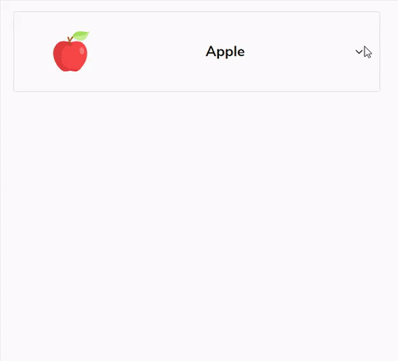

__Image-Based-Selection__       | 
:-------------------------:|
 |

# Installation

To use, just copy the component JS and CSS files and drop them in your project wherever you want

Make sure that you inserted the following `link` tag between the `<head></head>` tags inside `/public/index.html` of your react project. This is required for the `FontAwesome` component that the package depends on.

    <link href="https://maxcdn.bootstrapcdn.com/font-awesome/4.7.0/css/font-awesome.min.css" rel="stylesheet" />

# Usage

First, import the components:

```javascript
import { ImageDropDown } from './ImageDropDown.js';
```

The structure of the state for the dropdown data can be found in the fruitList.js. 
All that is needed is an Array of Objects with a 'label' and 'value':

```javascript
const list = [ 
  { label: 'Grape', value: 'http://www.somesite.com/grape.png' }, 
  { label: 'Cherry', value: 'http://www.somesite.com/cherry.png' }
 ]
```

Finally use the components as follows:

```javascript
<ImageDropDown
  list={this.state.fruitList}
  selected={this.state.selected}
  onChange={this.changeSelected}
/>
```
